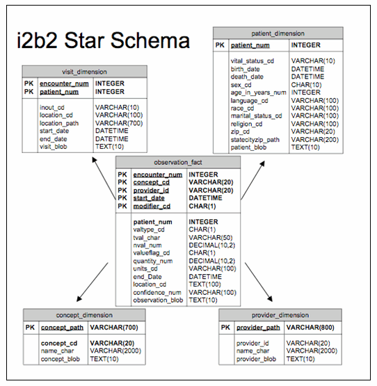

### Database with an I2B2 schema storing all information harvested onsite

The Capture database enables the collection of lots of information coming from the hospital EHR data or from research cohort metadata in an unaltered way.

At this point, no attempt is made to select or transform the data to fit into the [MIP Common Data Elements](../cde).

This database serves purely the data curation process: data elements are identified, described, collected and managed in a database.

To support the capture of as much information as possible, we have adopted the widely used I2B2 database schema, a variant of the star schema commonly used in [data marts](https://en.wikipedia.org/wiki/Data_mart)

An interesting consequence of this choice is that as several research databases and hospital data exports for research use I2B2, the data importation process is a simple database copy.