The processing pipelines provided out-of-the-box by the Data Factory enable an automated processing of data made available to MIP Local or MIP Federated.

### Overview Of All Pipelines

### Reorganisation Pipeline

This pipeline takes data organised on the disk in its original format and reorganise it into something that fits the layout expected by the following pipelines (EHR, pre-processing, metadata).

### EHR Curation Pipeline

This pipeline captures as many variables as possible from the patient records and stores the data into a database compliant with I2B2 schema ([‘I2B2 capture’ database](./capture_i2b2))

### Metadata Curation Pipeline

This pipeline collects the information associated with MRI scans and present either in DICOM headers or in associated metadata files and stores in into the (([‘I2B2 capture’ database](./capture_i2b2))

### MRI Pre-Processing And Feature Extraction Pipeline
This pipeline takes MRI data organised following the directory structure /PatientID/StudyID/SeriesProtocol/SeriesID/ and applies a series of processing steps on it, including:

- Conversion from DICOM to Nifti
- Neuromorphometric pipeline
- Quality control

For each step, data provenance is tracked and stored in a ‘Data Catalog’ database.

### Normalisation And Data Export Pipeline

This pipeline is triggered on a patient record when there is enough information collected (both EHR and biomarkers from MRI are required). It uses the data mapping and transformation specifications provided by the DGDS committee to select the variables of interest and normalise them into the [MIP Common Data Elements](../cde) reference.

This pipeline provides the final results produced by the Data Factory.

| From Data Factory output specifications                                                                                                                                                                                                                                                                                                                                                                                                                   |
|-----------------------------------------------------------------------------------------------------------------------------------------------------------------------------------------------------------------------------------------------------------------------------------------------------------------------------------------------------------------------------------------------------------------------------------------------------------|
| The ouput of Data Factory is a set of research-grade data containing the biomarkers extracted from MRI scans and the variables extracted from the patient (or research subject) EHR records.This information is sent to the [Hospital Database](../../hospital-database) and provided to the machine learning and statistical analysis algorithms of the [Algorithm Factory](../../algorithm-factory) as well as the [distributed queries](../../hospital-database/distributed-queries/) when the instance of MIP at a hospital is connected to the Federation. |