MIP Federated brings together several hospitals and clinical data centers to build a Federation.

Data are collected at each hospital (clinical data) or clinical data centers (research data), then a user of MIP can query and do machine learning or statistical analyses but with the strong imperative that only data aggregates are exchanged between the hospital or data centers and the central node hosting the user-facing web site.

### Flow Of Data In MIP Federation

