MIP Local is installed in participating hospitals and used to collect clinical data provided by the hospital. Only patients with consent are selected, and no data ever leaves the hospital premises.

### Flow Of Data In MIP Local Installed At A Hospital

